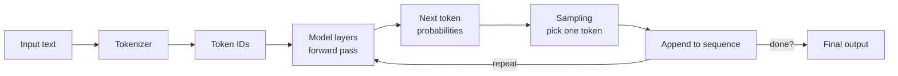
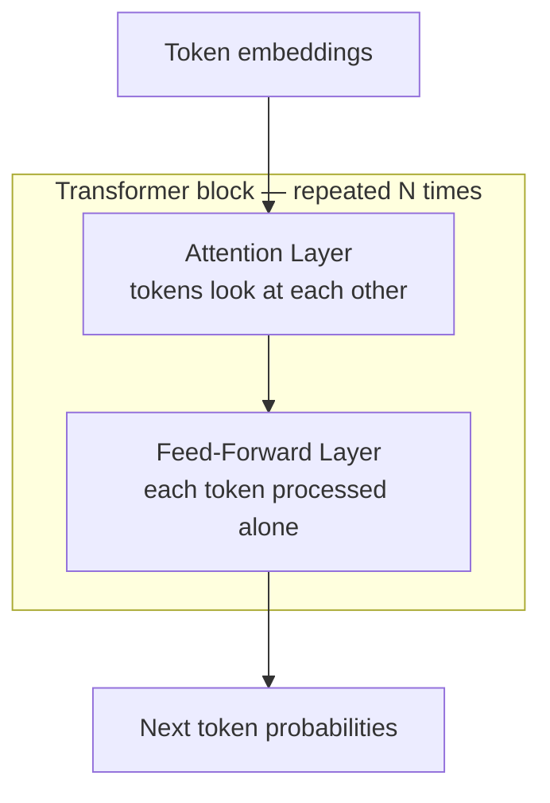
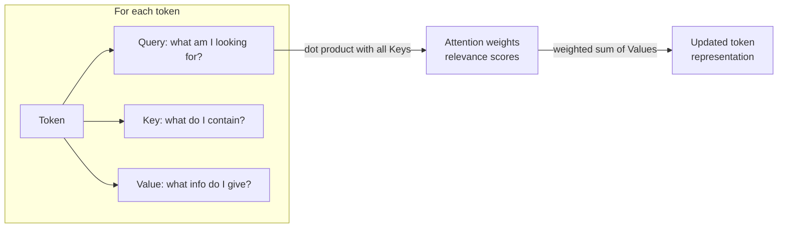

# How LLMs Actually Work

You don't need to understand backpropagation to be a good AI architect. But you do need a working mental model of what happens when you call the API.

Here's the core of it: an LLM takes a sequence of tokens and predicts what the next token should be. That's it. Chat, instruction following, tool use, agents, "reasoning" — all built on top of that one operation, repeated in a loop.

When you send a prompt:
1. Your text gets split into tokens (sub-word chunks)
2. The model processes all those tokens through its layers
3. It outputs probabilities for what the next token should be
4. A sampling strategy picks one token
5. That token gets appended to the sequence
6. Go back to step 3, repeat until done

That's the generation loop. Everything else in this curriculum is about controlling, constraining, or augmenting it.

## Key concepts

Terms you'll see throughout. Brief definitions here; deeper explanations below.

| Term | What it means |
|---|---|
| **Token** | A sub-word unit. The model sees tokens, not words. "Strawberry" might be 1-3 tokens depending on the model. |
| **Context window** | Max tokens the model can handle at once (input + output combined). |
| **Attention** | The mechanism that lets each token "look at" every other token to figure out what's relevant. Makes transformers work. Expensive — roughly O(n²) in sequence length. |
| **Forward pass** | One run of the input through all the model's layers to produce an output. Each new token requires one forward pass. |
| **Inference** | Running the trained model to generate output. What you do when you call the API. |
| **Temperature** | Controls randomness. 0 = always pick the most likely token. Higher = more variety. |
| **Hallucination** | Model confidently produces false output. Inherent to how generation works — not a bug you can patch. |
| **KV cache** | Stored computation from previous tokens so the model doesn't redo work. Why memory is often the bottleneck for long contexts. |

## Why things work the way they do

Once you have the generation loop in your head, a lot of LLM behavior becomes predictable:

**Why are LLMs slow?** Each new token requires a full forward pass — the input goes through every layer of the network once. A 500-token response means 500 forward passes. You can stream tokens to the user as they're generated, but you can't skip the computation.

**Why does context length cost money?** The attention mechanism compares every token to every other token. Double the context length and the computation roughly quadruples. That's why a 128K-token call costs significantly more than a 4K-token call.

**Why do models lose track of instructions in long prompts?** Attention spreads across all tokens. Your system prompt at position 0 is competing with 100K tokens of documents for the model's attention budget. Sometimes the documents win.

**Why does "think step by step" help?** More output tokens = more computation. When the model generates reasoning steps, it's doing additional processing that can lead to better answers. You're buying more compute by asking for more output.

**Why do structured outputs sometimes break?** The model picks tokens one at a time based on probabilities. It's biased toward valid JSON by your prompt, but it can still pick a token that breaks the syntax. It's probabilistic, not guaranteed.

## The building blocks

A transformer model is made of layers stacked on top of each other (dozens to hundreds of them). Each layer has two main parts:

**Attention layer** — this is where tokens look at each other. Each token asks "which other tokens are relevant to me?" and pulls information from them. Explained in detail in the next section.

**Feed-forward layer** — a simple neural network that processes each token independently after attention. Think of it as a lookup table with billions of entries. Most of the model's factual "knowledge" is stored here — patterns it learned during training, encoded as numerical weights. When people say a model "knows" something, what they really mean is that the feed-forward layers have weights that produce the right tokens in the right context.

These two layers alternate: attention (tokens talk to each other) → feed-forward (each token gets processed individually) → attention → feed-forward → ... repeated many times. By the final layer, the model has enough information to predict the next token.

Other pieces:
- **Tokenizer** — splits text into token IDs before anything else happens. Different models use different tokenizers, so the same text produces different token counts.
- **Embedding layer** — converts each token ID into a vector (a list of numbers) that the network can work with.
- **Output layer** — converts the final vector back into probabilities over all possible next tokens.

## Attention: how tokens talk to each other

This is the mechanism that makes transformers special. Older architectures (RNNs) processed tokens one by one in order. Attention lets every token look at every other token directly — which is why LLMs can connect a pronoun on page 3 to a name on page 1.

Here's how it works:

Each token gets transformed into three vectors:
- **Query (Q)** — "what am I looking for?"
- **Key (K)** — "what do I contain?"
- **Value (V)** — "what information do I provide if you pick me?"

For each token, the model checks how well its Query matches every other token's Key (using a dot product — basically measuring similarity). High match = high attention weight. Then it takes a weighted average of all the Values.

Result: each token's representation becomes a mix of information from all other tokens, weighted by relevance.

Example: in "The cat sat on the mat. It was tired". — the token "It" will attend strongly to "cat" because their Q-K match is high. The model learns these Q/K/V transformations during training.

**Multi-head attention** runs this process multiple times in parallel — typically 32 to 128 independent copies, called "heads". Why multiple? Each head learns to pay attention to different things. One head might learn to track grammatical relationships (subject-verb), another might track semantic similarity (synonyms), another might track nearby tokens. Running many heads in parallel and combining their outputs gives the model a richer understanding than any single attention pass could.

**Causal masking** (during generation): token at position 5 can only attend to positions 0-4, not 6+. This enforces left-to-right generation — the model can't peek at future tokens.

### Why this matters for you

- **Cost scales quadratically.** Every token attends to every other token. Double the context = ~4x the attention computation. This is why long contexts are expensive.
- **"Lost in the middle."** In practice, tokens at the start and end of the context get more attention than those in the middle. Put important information near the end of your context, close to the query.
- **Memory is the real limit.** The KV cache (stored Keys and Values from previous tokens) grows with context length. On a GPU, this memory is often what limits how long a context you can use — not the compute itself.
- **Position isn't built in.** Attention just compares vectors — it doesn't inherently know position. Position information gets added separately (via techniques called RoPE or ALiBi). This is why extending a model's context window requires specific engineering.

## Training (what you need to know)

Three stages, each building on the last:

1. **Pretraining** — the model learns to predict the next token on massive text (books, web, code). Costs hundreds of millions of dollars. Produces a "base model" that can complete text but doesn't follow instructions well.
2. **Supervised fine-tuning (SFT)** — train on curated instruction/response pairs. This teaches the model to be helpful and follow directions.
3. **RLHF / preference tuning** — train the model to prefer outputs that humans rate highly. This is where safety behavior, personality, and refusal patterns come from.

What this means for you:
- Model behavior comes from training. You can't easily override it from outside.
- Refusals and safety are trained preferences, not hard rules — they can be bypassed (hence prompt injection).
- Different providers (Anthropic, OpenAI, Google) make different training choices, which is why models feel different.
- You work with what the training gave you. Your job is to steer it, not reprogram it.

## Common jargon, translated

| What people say | What they mean |
|---|---|
| "It's just autocomplete" | True at the mechanism level. Dismissive about what emerges from it. |
| "The model is reasoning" | It's generating tokens that look like reasoning. Sometimes correct, sometimes confident nonsense. |
| "Hallucination" | Confidently wrong output. Inherent to generative models. Design around it. |
| "Parameters" | The model's size (number of learned weights). More = more capable, more expensive. |
| "Frontier model" | The current most-capable class. Changes every few months. |
| "Emergent capabilities" | Things the model does well that weren't explicitly trained. Real but overhyped. |

## Things that trip people up

**"The model knows X."** It doesn't know anything. It has statistical patterns. It fails on obscure-but-real facts and succeeds on common-but-wrong ones. Never use it as a factual database without retrieval.

**Token ≠ word.** 1,000 tokens ≈ 750 English words ≈ 500 French words. Code tokenizes differently. Use the actual tokenizer when estimating costs.

**Non-determinism is the default.** Same prompt, different outputs (at temperature > 0). Even at temperature 0, there's some variance. Design for it.

**Instruction-following is soft.** The model is biased toward following your instructions, not guaranteed to. 99% success rate = fails 1 in 100 times in production.

**Context ≠ memory.** Within one call, the model sees everything. Across calls, it remembers nothing. "Memory" in agents is a system you build around the model.

## Where the field actually is

We don't fully understand why LLMs do what they do. Research on interpretability (what's happening inside the model) is active but incomplete. The practical implication: you can't reason about LLM behavior the way you reason about deterministic code. You have to treat it empirically — test, measure, iterate.

This is uncomfortable for engineers used to reading source code to understand behavior. Get comfortable with it. The whole curriculum is built around this reality.

## Go deeper

- **Andrej Karpathy's "Deep Dive into LLMs like ChatGPT"** on YouTube (3 hours, excellent)
- **"The Illustrated Transformer" by Jay Alammar** — visual architecture walkthrough
- **Anthropic's "Mapping the Mind of a Large Language Model"** — interpretability research
