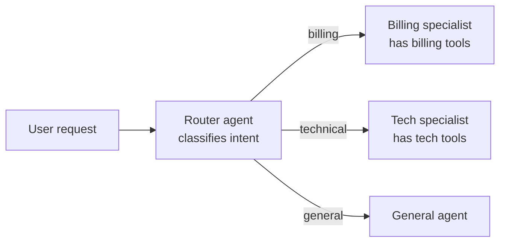

# Multi-Agent Patterns

Multi-agent systems have multiple LLM-driven components working together on a task. They're often more impressive in demos than in production.

The honest heuristic: multi-agent is worth it when different subtasks genuinely need different contexts, different tools, or different prompts. It's not worth it to make architecture diagrams look more sophisticated.

## Patterns that work

### Router + specialists

A classifier agent looks at the incoming request and routes it to a specialist agent with a narrower tool set and more focused prompt.

This works because each specialist has a smaller, more focused context. The router is cheap (often a single classification call). The specialists are more reliable because they have fewer tools and a clearer job.

### Orchestrator + workers

A planning agent decomposes a complex task into subtasks and delegates each to a worker agent.

Example: "Research this topic and write a report" becomes:
1. Orchestrator plans: search for sources, summarize each, synthesize into report
2. Worker 1: searches and retrieves sources
3. Worker 2: summarizes each source
4. Orchestrator: synthesizes summaries into final report

This works when the subtasks are genuinely independent and benefit from different contexts or tools.

### Critic / reviewer

One agent produces output, another critiques it, they iterate.

Example: Agent A writes code. Agent B reviews it for bugs. Agent A revises based on feedback. This can improve quality on tasks where verification is easier than generation — code (you can run tests), factual claims (you can check sources), math (you can verify).

The risk: they can loop forever if the critic is too strict or the producer can't satisfy the feedback. Always set a max iteration count.

### Human-in-the-loop as an agent

The human is a first-class participant in the multi-agent system. The orchestrator can "call" the human the same way it calls other agents — asking for input, approval, or clarification.

This is often the right architecture for high-stakes workflows where full autonomy isn't appropriate.

## Anti-patterns

**Role-playing theater.** "You are a product manager. You are an engineer. You are a designer. Now discuss this feature." Looks impressive in demos. Rarely produces better output than a single well-prompted agent. The "discussion" is just the model talking to itself with different system prompts.

**Deep agent hierarchies.** An orchestrator calls a sub-orchestrator that calls workers. Each level adds latency, cost, and failure modes. Keep hierarchies flat — one level of delegation is usually enough.

**"Let them negotiate."** Two agents with different opinions trying to reach consensus. They don't converge — they loop. LLMs don't have genuine disagreements; they have different sampling paths. "Negotiation" between them is theater.

**Multi-agent as a proxy for unclear requirements.** If you can't specify what you want from a single agent, adding more agents won't help. It'll just distribute the confusion.

## Cost and complexity

Multi-agent systems multiply costs. If each agent call costs X tokens, and you have 3 agents each making 3 calls, that's 9X minimum. In practice it's often worse because agents pass context to each other, growing the token count at each step.

Latency also multiplies. Sequential agent calls (orchestrator → worker → orchestrator) add up. Parallel calls help but add coordination complexity.

Debugging is harder by an order of magnitude. When something goes wrong, you need to trace across multiple agents, each with their own context and decision history. Without strong observability from the start, debugging multi-agent systems is guesswork.

## When to use multi-agent vs simpler alternatives

| Situation | Better approach |
|---|---|
| Task has clear subtasks needing different tools | Multi-agent (router + specialists) |
| Task needs generation + verification | Multi-agent (producer + critic) |
| Task is complex but sequential | Single agent with good tools |
| Task is simple but you want it to "feel" sophisticated | Single agent. Don't over-engineer. |
| You want "agents to brainstorm" | Single agent with chain-of-thought. The brainstorming is theater. |

## Things that trip people up

**Cost surprises.** A multi-agent system that costs $0.05 per request in testing costs $0.50 per request when agents loop more than expected on edge cases. Monitor per-request cost in production.

**Coordination overhead.** Every message between agents is tokens. Passing a 2000-token context from one agent to another costs money and uses up context budget.

**When the orchestrator is wrong, everything downstream is wrong.** If the router misclassifies, the specialist gets a request it can't handle. If the planner makes a bad plan, workers execute bad steps. The orchestrator is the single point of failure.

**Observability is non-negotiable.** You need to trace the full path: which agent was called, what it received, what it produced, what happened next. Without this, you can't debug anything.

## Where things stand

Multi-agent systems are still experimental for most production use cases. The router + specialists pattern is the most mature and widely deployed. Full orchestrator + workers systems work for specific narrow cases but are fragile at scale.

The field is moving fast. New coordination patterns, better frameworks (LangGraph, AutoGen), and better observability tools are making multi-agent more practical. But the default should still be: start with the simplest thing that works, and only add agents when you've demonstrated that a single agent can't handle the task.

## Go deeper

- [Anthropic's "Building Effective Agents"](https://www.anthropic.com/research/building-effective-agents) — includes multi-agent patterns
- [AutoGen documentation](https://microsoft.github.io/autogen/) — the framework most focused on multi-agent
- Workshop W5 — Multi-Agent System. Build one and experience the failure modes.

---

[← Previous](08-mcp-and-tools.html){: .mr-4 } [Next: State, Memory, and Durability →](10-state-memory-durability.html)
