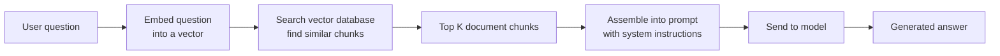

# Context Engineering

Prompts get all the attention, but in real systems the prompt is usually the smallest part of what the model sees. The bigger challenge is assembling the full input — called the **context** — that the model receives on each call.

A typical production call includes:

- A system prompt (stable, versioned)

- Retrieved documents (pulled from a knowledge base based on the user's question)

- Conversation history (what was said before in this session)

- Tool outputs (results from functions the agent called)

- User state (profile, permissions, preferences)

- The current user input

The model sees all of this as one long sequence of tokens. Its response depends on the entire sequence. Context engineering is about assembling that sequence well — deciding what goes in, in what form, and in what order.

This is the more honest name for what people used to call "prompt engineering" once they realized the prompt is usually 5% of the input.

## Why this is where most systems fail

Most production AI failures are context failures, not model failures. The model gets the wrong documents, too many documents, stale information, or conflicting instructions — and produces a bad answer that gets blamed on "hallucination".

The model has no way to know which parts of its context are relevant, trustworthy, or current. That's your job as the engineer.

## The three jobs of context engineering

### 1. Deciding what to include

The context window is a budget. Even with 200K tokens available, you have to choose what's worth spending tokens on.

Trade-offs you'll face:

- More retrieved documents → better chance of including the right answer, but more cost and more risk of the model getting confused

- More conversation history → better continuity, but old messages can conflict with current instructions

- Tool outputs → essential when fresh, noise when stale

- Examples → helpful for unfamiliar tasks, wasteful for routine ones

A context assembly strategy is a design decision worth documenting. Most teams don't, and end up with ad-hoc assembly that works until it doesn't.

### 2. Formatting what's included

Same information, different format, different results.

What works:

- Clear boundaries between sections (`<document id="42">...</document>`)

- Metadata on retrieved documents (title, date, source) — helps the model cite correctly

- Important content near the end of the context, close to the user's question — models pay more attention to recent tokens

- Structured data (JSON, tables) for factual information

What doesn't:

- Dumping raw documents without structure

- Mixing instructions and data without clear boundaries

- Burying critical information in the middle of a 100K-token context

### 3. Keeping context coherent

The model can't detect contradictions. If one document says "policy X was retired" and another says "policy X applies to all users" the model may cite either one or try to merge them into something confused.

This is why retrieval quality matters so much. You're not just finding relevant documents — you're trying to produce a coherent input that supports a correct answer.

## RAG: Retrieval-Augmented Generation

RAG is the standard pattern for giving LLMs access to information they weren't trained on. For instance, your company's docs, recent data, user-specific information. Here's how it works:

The steps:

1. **Split your documents into chunks** (paragraphs or sections, typically 200-500 tokens each)

2. **Convert each chunk into a vector** (a list of numbers that represents its meaning) using an embedding model

3. **Store those vectors** in a vector database

4. **When a user asks a question**, convert their question into a vector too

5. **Find the chunks whose vectors are most similar** to the question vector (nearest neighbor search)

6. **Put those chunks into the prompt** as context

7. **Generate the answer** based on the retrieved context

This is called "naive RAG". It works well for straightforward questions and fails predictably for harder ones.

### Where naive RAG breaks down

I experienced a few issues when I worked on a project to [derive operational insights from AWS Support Cases](https://aws.amazon.com/blogs/machine-learning/derive-meaningful-and-actionable-operational-insights-from-aws-using-amazon-q-business/).

**Chunking problems.** If you split a document in the wrong place, the relevant information might be split across two chunks, and neither chunk alone makes sense. There's no universal right answer — it depends on your documents.

**Bad queries.** Users ask short, ambiguous questions. "What's the policy?" could match dozens of documents. Rewriting the user's question into a better search query (sometimes using the LLM itself) is a cheap improvement most teams skip.

**Wrong results ranked high.** Vector similarity isn't perfect. Modern embeddings handle obvious word-overlap cases fine (they won't confuse "apple pie" with "Apple stock") — but they fail on subtler ones: a medical "discharge summary" matching a query about battery "discharge", or two documents that mean the same thing but use different words. Adding a **re-ranking step** — a second, more precise model that re-scores the top results — is often the single biggest quality improvement you can make.

**Keyword misses.** Vector search finds semantically similar content, but can miss exact keyword matches. Combining vector search with traditional keyword search (called **hybrid search**) usually beats either alone.

**No answer available.** The user asks something your documents don't cover. Without explicit handling, the model will synthesize an answer from whatever was retrieved, even if it's off-topic. You need to design the prompt to say "I don't have information about that" when retrieval comes up empty.

## Memory for agents

An agent that runs across multiple turns needs to remember what happened. But the model itself is stateless — it forgets everything between calls. "Memory" is a system you build around the model.

**Short-term memory** (within a session): conversation history, what the agent has tried so far, recent tool results. Usually just kept in the context, trimmed or summarized as it grows too long.

**Long-term memory** (across sessions): user preferences, facts learned in prior conversations, past decisions. Usually stored in a database or vector store, retrieved at the start of each session.

The gotcha: memory decays in quality over time. Old facts become stale. Preferences change. Contradictions accumulate. If you add memory to your system, you also need memory maintenance — TTLs on stored facts, periodic re-validation against source data, letting users correct or delete memories explicitly, and a conflict resolution strategy for when old memory contradicts fresh context. Most teams skip this and pay for it later when the agent confidently acts on information from six months ago that's no longer true.

## The "lost in the middle" problem

Research shows that LLMs pay more attention to tokens at the beginning and end of their context than those in the middle. If critical information is buried in the middle of a long context, the model may miss it.

So: put the most important retrieved documents near the end of the context, close to the user's question. Don't just dump them in order of retrieval score — think about position.

## When to use RAG vs other approaches

- **Use RAG** when the knowledge is factual, changes over time, or is specific to your organization. You want the model to cite sources and stay current.

- **Use fine-tuning** when you want to change how the model behaves (its style, format, or approach to a task). Fine-tuning doesn't add knowledge well — it changes behavior.

- **Use agents** when the task requires multiple steps, decisions, or tool use that unfolds over time.

Most real systems combine all three: a fine-tuned or instruction-tuned model, driven by an agent, using RAG for knowledge.

## Things that trip people up

**"We'll just put everything in the context."** Tempting with large context windows. Bad idea. Costs go up, latency increases, the model gets confused, and you still can't guarantee it uses the right information.

**Changing your embedding model is expensive.** If you switch to a new embedding model, you have to re-process every document in your database. Pick carefully upfront.

**User data in context flows to the model provider.** Retrieved documents and chat history often contain personal information. That data now goes to whoever hosts the model. Know your data flow.

**RAG without a "say I don't know" path.** A system that always answers will hallucinate when retrieval fails. Test explicitly for the "no relevant documents found" case.

## Where things stand

Context engineering is still an active practice, not a settled discipline. The tooling is improving (better vector databases, better re-ranking models, better hybrid search) but best practices are still shifting.

If you take one thing from this chapter: the model is only as good as the context you give it. Most "the AI is wrong" complaints are actually "the context assembly is wrong" complaints.

## Go deeper

- [Workshop W2 — First RAG Pipeline](../05-workshops/W2-rag-pipeline.md) — build one end-to-end

- [Anthropic's Contextual Retrieval blog post](https://www.anthropic.com/news/contextual-retrieval) — practical technique that improves RAG quality

- [Lost in the Middle](https://arxiv.org/abs/2307.03172) (Liu et al., 2023) — the research on attention and position

- [LangChain's RAG documentation](https://python.langchain.com/docs/tutorials/rag/) — concrete patterns and code
