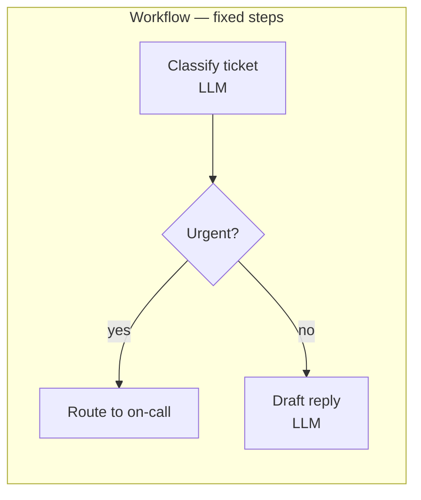
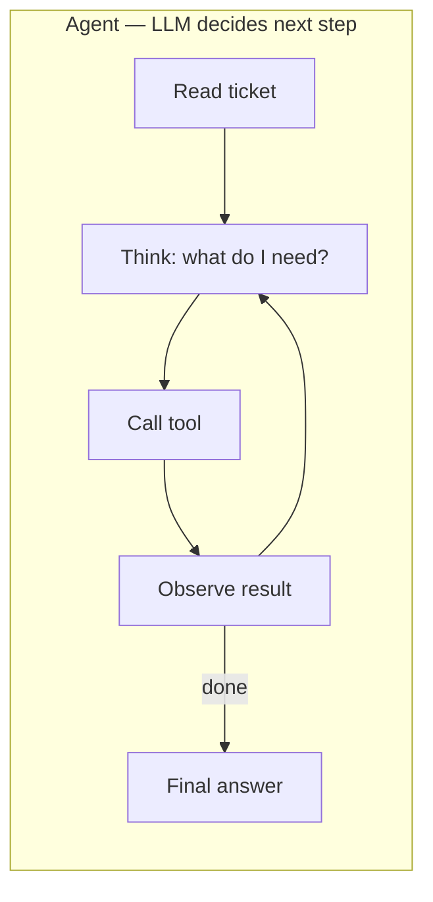
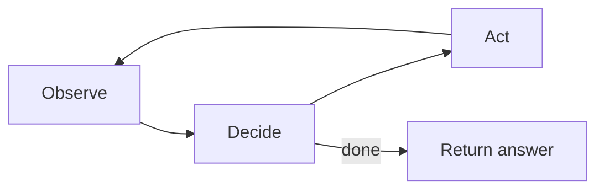

# What an Agent Actually Is

"Agent" is the most overloaded term in AI right now. A chatbot that retrieves documents gets called an agent. An autonomous system that plans goals, takes actions, and runs unsupervised for hours also gets called an agent. The word has become nearly useless without qualification.

Here's a spectrum that helps:

1. **Augmented generation** — an LLM plus retrieval. No tool use, no decisions. Not really an agent, but often labeled as one.
2. **Tool use** — the LLM can call functions to get information or take action. It decides which tools to call and with what arguments.
3. **Reason-and-act loops** — the model alternates between thinking and doing. Each step depends on the result of the previous one.
4. **Goal-directed agent** — the model breaks a high-level goal into steps, executes them, and revises the plan when things change.
5. **Autonomous agent** — the model operates in a loop with memory, tools, and initiative over long time horizons. Still rare in production.
6. **Multi-agent systems** — multiple LLMs in different roles, coordinating via messages or shared state.

The operational definition I find most useful comes from Anthropic's taxonomy: an agent is a system where an LLM dynamically controls its own process and tool usage. If the steps are predetermined and the LLM just fills in slots, it's a workflow, not an agent.

Knowing where your system sits on this spectrum is the most important architectural decision you'll make. Many teams drift toward the complex end when something simpler would work — and pay for it in latency, cost, and reliability.

## Workflow vs. agent

A workflow is a system where the control flow is predetermined. You decide at design time what the steps are and in what order. An LLM may be called at each step, but it doesn't decide what happens next.

An agent is a system where the LLM decides the control flow. It chooses what to do next based on observation and reasoning.





Same task, different architecture. The workflow is cheap, reliable, easy to evaluate, easy to debug. The agent is more flexible and handles novel situations the workflow wasn't designed for. It's also harder to predict, harder to evaluate, harder to debug, and more expensive.

Both are valid. The question is which fits your problem.

Use a workflow when:
- The task decomposes cleanly into known steps
- The same steps work for most inputs
- You need predictable cost and latency
- You need behavior you can guarantee

Use an agent when:
- The right sequence of steps depends on the input
- You can't anticipate all the cases at design time
- The flexibility is worth the complexity

Many real systems are hybrids. The top-level flow is a workflow; one node of the workflow is an agent that handles the open-ended part.

## The agent loop

Every agent runs the same basic loop:



In pseudocode:

```
while not done:
    observation = read_current_state()
    decision = model(context + observation + tools)
    if decision.is_final_answer:
        return decision.output
    else:
        tool_result = execute(decision.tool_call)
        context = append(context, decision, tool_result)
    if exceeded_budget():
        return graceful_failure()
```

Everything else — frameworks, patterns, orchestrators — is variations on this loop.

The parameters that matter:

- **Budget** — max loop iterations, max tokens consumed, max wall-clock time, max dollars spent.
- **Stop conditions** — when does the agent decide it's done? When do you force it to stop?
- **Tool set** — what can the agent call? What can't it?
- **Context management** — how do you keep the context from growing without bound as the loop runs?
- **Memory** — what persists across loop iterations? Across sessions?
- **Error handling** — what happens when a tool call fails? When the model produces malformed output?

Most agent engineering is getting these parameters right for your specific task.

## Decision-making patterns

**ReAct** (short for "Reason + Act") is the baseline pattern. The model outputs alternating reasoning ("I need to look up the customer's order history") and actions (calls the lookup tool). Each step depends on what it learned from the previous one. Most production agents are ReAct-flavored whether they call it that or not.

**Plan-and-Execute** separates planning from execution. The model generates a full plan first, then executes step by step. More predictable cost. Less flexible — harder to recover if a step fails in a way the plan didn't anticipate.

**Reflexion / self-correction** has the agent review its own work and retry. "Here's my answer. Let me check if it's right. Actually, it's wrong because X. Let me try again." Adds cost but can improve quality on tasks where verification is easier than generation — like code, where you can run tests.

What actually works in production: basic ReAct with solid tool descriptions, clear stop conditions, good error handling, and eval-driven iteration. Fancy patterns rarely pay for themselves on routine tasks.

## When not to use an agent

- When a workflow is simpler. This is most tasks.
- When predictable cost matters. Agent loops have highly variable token consumption.
- When low latency matters. Each loop iteration is a round trip to the model.
- When reliability is critical. Agents fail in more ways than workflows.
- When you can't afford to debug exotic failure modes.
- When the task has a clear structure. If you can write the steps down, you probably shouldn't ask the model to figure them out.

Teams often default to "let's build an agent" because it sounds more impressive. The simpler architecture that solves the problem is usually the right one.

## Production realities

Most "agents" in production are loops around tool-using LLMs. That's not dismissive — it's accurate. The loop, the tools, the stop conditions *are* the agent.

Agent reliability is often below 80%. Not "the model is wrong 20% of the time" — "the full agent trajectory gets to the right outcome 80% of the time." For many use cases, 80% isn't good enough. The path to 95% is engineering (eval, iteration, human-in-the-loop), not a better model.

Cost scales with loop depth. A 10-step agent is at least 10x the cost of a single call. Longer contexts on each step make it worse.

Latency scales with loop depth too. For interactive use, users hate waiting through 10 sequential model calls.

Agents need eval harnesses even more than single calls do. Because the trajectory can go many ways, small changes in prompt or tool schema can introduce subtle regressions. Without eval, you're flying blind.

## Common mistakes

**Loops that don't terminate.** The model keeps calling tools, getting results, calling more tools, never deciding it's done. Always have a max step count and a max token budget. A runaway agent can blow your bill in hours.

**Tool hallucinations.** The model calls a tool you didn't give it, or passes arguments that don't fit the schema. Validate every tool call before executing. Return a graceful error so the model can recover.

**Plan drift.** The model generates a plan at step 0, starts executing, learns something that invalidates the plan, but keeps following the original plan anyway. Good agents re-plan in response to observations.

**Over-trusting autonomy.** "The agent decided to do X" is not a satisfying explanation when X is expensive or wrong. Agents need observability, budgets, and human checkpoints proportional to the stakes.

**Escalating complexity.** A team starts with a simple agent, it works OK, they add memory, then multi-agent coordination, then self-reflection, and now the system is brittle and hard to debug. Complexity has costs. Add it only when the simpler version demonstrably fails.

**The "agent" label confuses stakeholders.** Product managers, executives, and customers have wildly different mental models of what "agent" means. Be specific: "This is a tool-using assistant with three tools and a max budget of 5 steps" is clearer than "an autonomous agent."

## Where things stand

Agent architecture is the most active area of applied AI engineering as of late 2025.

What's settled:
- Workflows with LLMs at nodes are a strong, cheap, reliable pattern for many tasks
- Simple tool-using agents work well for tasks that need flexibility
- Multi-agent systems are still experimental; they work for some narrow use cases

What's not settled:
- How to evaluate agents at scale
- How to guarantee agents stay safe across long horizons
- Whether "autonomous" agents are a meaningful production category yet

Expect the field to change substantially over the next 2-3 years. The mental model of "where on the spectrum" will remain useful even as the specific techniques evolve.

## Go deeper

- [Anthropic's "Building Effective Agents"](https://www.anthropic.com/research/building-effective-agents) — the single most useful contemporary piece on agent architecture
- ["ReAct: Synergizing Reasoning and Acting in Language Models"](https://arxiv.org/abs/2210.03629) (Yao et al., 2022) — the paper that kicked off the current wave
- Workshop W4 — Tool-Using Agent. Build one from scratch without a framework.
- [HuggingFace's agents course](https://huggingface.co/learn/agents-course) — practical, free, code-heavy
