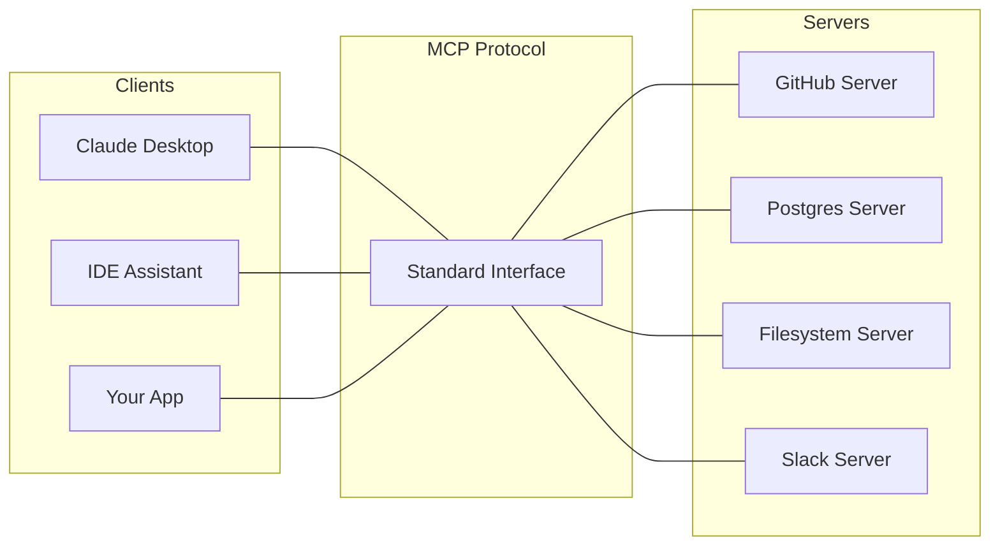

# MCP and Tool Interfaces

Tools are how LLMs do things in the real world. An LLM alone generates text. An LLM with a "send email" tool sends email. An LLM with an "execute SQL" tool reads your database.

The tool interface is one of the most consequential design decisions in an agent system. It determines what the agent can do, how reliably it does it, and what can go wrong.

Model Context Protocol (MCP) is an open protocol from Anthropic, released in late 2024 and gaining traction through 2025. It standardizes how AI applications connect to tools and data sources. Think of it the way USB-C standardized physical connections — MCP is attempting to standardize LLM-to-tool connections.

The thing to remember about tools: the model never sees your code. It sees the natural-language description of what the tool does and when to use it. Tool descriptions are part of the prompt. Tools are prose first, code second.

## Why tool problems dominate agent debugging

Most "the agent is broken" complaints trace to tool issues:

- Bad tool descriptions → the model picks the wrong tool or doesn't recognize when to use one
- Bad tool schemas → the model hallucinates arguments
- Too many tools → the model gets confused or picks suboptimally
- Too few tools → the agent can't complete the task
- Tools that fail loudly → the model sees an error and gives up
- Tools that fail silently → the model proceeds on bad data

Tool engineering is 40-60% of agent engineering. It's worth taking seriously.

## Anatomy of a tool

Every tool has four parts: a name, a description, parameters, and a return value.

```json
{
  "name": "search_customer_orders",
  "description": "Look up a customer's order history. Returns up to 20 recent orders with order_id, date, status, and total. Use this when the user asks about their past purchases, order status, or when you need to reference a specific order.",
  "parameters": {
    "type": "object",
    "properties": {
      "customer_id": {
        "type": "string",
        "description": "The customer's unique ID, usually from auth context."
      },
      "status_filter": {
        "type": "string",
        "enum": ["all", "open", "completed", "cancelled"],
        "description": "Filter by order status. Use 'all' if the user didn't specify."
      }
    },
    "required": ["customer_id"]
  }
}
```

A few principles that make tools work well:

**Specific names.** `search_customer_orders` not `search`. The name alone should give the model a strong hint about when to use the tool.

**Detailed descriptions.** Tell the model what the tool does, what it returns, and when to use it. "Use this when..." is the single most valuable phrase in a tool description.

**Typed parameters with descriptions.** Every parameter gets a description. Enumerate options. Tell the model what to do when a value is unspecified.

**Structured return values.** Give the model parseable output — JSON, tables, structured text. Don't return free-form prose that the model then has to re-parse.

**Stable schemas.** Tool schemas are part of the contract. Changing them subtly changes model behavior. Treat them like any API contract: versioned, tested, reviewed.

## Name and description as prompt engineering

The model never sees your implementation. It sees the name and description. So:

- Name a tool for what it does, not how it works. `check_refund_eligibility` not `call_stripe_api`.
- Describe side effects explicitly. If a tool sends email, say so. If it's read-only, say so.
- Include usage constraints. "Only call this for orders less than 30 days old."
- Anti-examples help. "Do not use this for general product questions; use `search_product_catalog` instead."

Time spent writing tool descriptions is prompt engineering. Write them carefully, test them, iterate.

## Return values

The return format shapes what the model can do next.

- Return everything the model might need. If orders have status, date, and total, return all three even if the user only asked about status. Fetching once is cheaper than fetching twice.
- Handle "nothing to return" gracefully. An empty result should say "No orders found for customer X" not return `[]`, which the model may misinterpret.
- Truncate sensibly. Returning 10MB of data to the model blows the context. Default to reasonable page sizes. Return counts and truncation metadata.

## Error handling

When a tool call fails, return a structured error with a clear message:

```json
{"error": "customer_id not found", "recovery": "Ask the user to verify the ID, or use search_customer_by_email"}
```

The error message is a prompt to the model. Write it to help the model recover. Don't raise an exception and crash the agent. Don't return nothing and let the model assume success.

## How many tools

Too few tools → the agent can't accomplish tasks. Too many → the model gets confused.

A rough heuristic: 5-15 tools is the sweet spot for most agents. Below 5 and you're often asking the model to improvise around missing capability. Above 15-20 and the model increasingly picks wrong tools or misses relevant ones.

When you have too many:

- **Hierarchical tool sets.** A "meta-tool" the agent calls first that returns a relevant subset.
- **Dynamic tool selection.** Use embeddings (vector representations of text) to retrieve the most relevant tools for the current query before giving them to the agent.
- **Multi-agent routing.** Specialist agents, each with their own tool subset; a router picks which specialist handles the query.
- **Just cut some tools.** Often the right answer. Many tools were added "in case" and aren't pulling their weight.

## Model Context Protocol (MCP)

### What it is

MCP is an open protocol that defines how AI applications (clients) connect to servers that expose tools, resources, and prompt templates. Published by Anthropic in November 2024, picked up by OpenAI, Google, and much of the ecosystem through 2025.

The pitch: instead of every AI app reimplementing connections to Gmail, GitHub, Slack, Postgres, and filesystems, there's a standard protocol. Anyone can write an MCP server that exposes their system. Anyone can write an MCP client that consumes those servers.

Think of it as the AI equivalent of LSP (Language Server Protocol). Before LSP, every code editor had custom integrations for every programming language. After LSP, one server talks to any compliant editor. MCP is trying to do the same thing for AI-to-tool connections.



### What an MCP server exposes

Three things:

- **Tools** — functions the LLM can call. Same concept as provider-native tool use, but portable across clients.
- **Resources** — data the LLM can read. Files, database rows, API responses.
- **Prompts** — templates the client can surface to the user. "Summarize this document," "Review this PR."

A single server can expose any combination. A filesystem MCP server exposes tools for reading/writing files and resources for the file tree. A database MCP server exposes tools for querying and resources for schema introspection.

### Transport and protocol

- **Transport:** stdio (subprocess), HTTP/SSE, or newer streamable HTTP. Stdio is common for local dev; HTTP for remote servers.
- **Capabilities negotiation:** client and server exchange what they support on connect.
- **Tool invocation:** client sends a tool call; server executes and returns the result.
- **Resource fetch:** client requests a resource; server returns content.

The protocol handles discovery ("what tools do you have?") and invocation, with metadata for schemas, descriptions, and pagination.

### The ecosystem as of late 2025

- Reference MCP servers exist for filesystem, fetch, GitHub, Slack, Google Drive, Postgres, SQLite, Puppeteer, and more
- Client support in Claude Desktop, several IDE assistants, Cursor, Cline, Warp, and growing
- Third-party servers for most popular SaaS tools (Notion, Linear, Jira, etc.)
- OpenAI added MCP support to their Agents SDK in 2025
- The modelcontextprotocol.io directory lists hundreds of servers

### Why it matters

**Portability.** An MCP server works with any compliant client. You're not tying your integrations to one AI provider.

**Ecosystem leverage.** You can use dozens of existing servers without writing them yourself.

**Local-first friendly.** Many MCP servers run locally, keeping your data on your machine.

### Building an MCP server

If you have a tool or data source you want to expose to agents, writing an MCP server is straightforward. SDKs exist for Python (`mcp` package) and TypeScript (`@modelcontextprotocol/sdk`).

Minimal example in Python:

```python
from mcp.server.fastmcp import FastMCP

mcp = FastMCP("my-server")

@mcp.tool()
def add(a: int, b: int) -> int:
    """Add two numbers."""
    return a + b

if __name__ == "__main__":
    mcp.run()
```

That's a working MCP server. Plug it into Claude Desktop and Claude can call `add`.

### Security implications

MCP lowers the bar to connecting tools to agents. That's good and dangerous.

- **No default authentication or authorization.** Servers you run locally trust the client. Servers over HTTP need you to add auth yourself.
- **Once connected, MCP tools are privileged.** The protocol doesn't enforce capability constraints; that's the application's job.
- **Untrusted MCP servers are a supply chain risk.** Running a random MCP server from the community is like running a random script from the internet. Audit before adopting.
- **Indirect prompt injection via MCP resources.** Content returned by an MCP server can contain injection payloads. Same defenses as with any tool that returns untrusted content.

Treat MCP servers like browser extensions. You wouldn't install a random browser extension; don't run a random MCP server. Check the source, understand the scope of what it can do, run with minimum privileges.

### MCP vs provider-native tool use

You can use Claude, GPT, Gemini, etc. with either their native tool use APIs (define tools in-code, pass to the API) or MCP (tools come from MCP servers, client handles the bridging).

Native tool use is simpler for contained use cases where you're writing and deploying all the tools yourself. MCP wins when you want to reuse external servers, maintain portability, or build something that others will consume.

For many production systems, both coexist: some tools defined natively (custom business logic), some via MCP (standard integrations).

## Design patterns

### Read tools vs. write tools

Separate them mentally and often physically. Read tools are safe to call speculatively. Write tools need guardrails.

- Read: `get_customer`, `search_products`, `list_tickets`
- Write: `update_customer`, `cancel_order`, `send_email`

Give the model read tools freely. Gate write tools with confirmations, budgets, or human checks depending on stakes.

### Tool composition

An agent can use tool output from one call as input to the next.

Design for this:
- If `search_customers` returns a list, each item should have a stable ID the agent can pass to `get_customer_details`.
- Return a cursor the model can use to fetch more, not just "there's more."
- If a common flow requires 4 tool calls, consider a higher-level tool that does all 4.

### Idempotency

Agent loops retry. Tools need to handle that.

If the agent calls `update_customer_email` twice with the same arguments, the second call should be a no-op or at least safe. Use idempotency keys when possible. For transient failures, retry internally with backoff before returning to the model. Don't burden the model's loop with retry logic.

## Gotchas

**Tool descriptions that read like code comments.** "Returns customer data" is not a description. "Retrieves the customer's profile including contact info, account status, and recent activity. Use this when answering questions about a specific customer or before performing customer-related operations" is a description.

**Argument hallucinations.** The model invents arguments. A tool expects `order_id` as a string like "ORD-12345"; the model passes `42`. Validate, type-check, return a clear error so the model can retry.

**Tool name conflicts.** If two tools have similar names, the model will conflate them. `search_orders` and `search_customer_orders` are different; the model may mix them up. Name distinctively.

**Return values that blow the context window.** A `list_files` tool that returns 10,000 files in a single call destroys the agent's budget. Default to reasonable page sizes.

**Indirect prompt injection via tool output.** A `fetch_url` tool returns a web page. The page has hidden instructions. The model follows them. Any tool that returns untrusted content is an injection vector.

**Rate limits invisible to the model.** External APIs rate-limit. If your tool wraps one, handle limits internally. Don't let rate-limit errors reach the model without context.

**MCP servers you didn't write.** Treat as untrusted. Audit the source. Run with least privilege. Don't give them access to credentials, networks, or data they don't need.

**Tool schemas drifting from implementation.** The schema says `status` is an enum of four values; the implementation returns a fifth. The model now sees output it can't parse. Keep schema and implementation in sync.

## Where things stand

Tool design is mature as a discipline — the principles above are well-established, and tool-using LLMs work well in production today. MCP is younger but has strong momentum; it's reasonable to bet on it for new systems.

Watch for:
- MCP security practices to formalize (auth, capability scoping)
- Tool schema standards to stabilize across providers
- Tool discovery and marketplace patterns to mature
- Evaluation tooling for tool-using agents to improve

## Go deeper

- [modelcontextprotocol.io](https://modelcontextprotocol.io) — the official MCP spec and server directory
- [Anthropic's "Tool use with Claude" docs](https://docs.anthropic.com/en/docs/build-with-claude/tool-use) — practical patterns that apply to any LLM
- [MCP source code on GitHub](https://github.com/modelcontextprotocol) — reading the SDK source is one of the best ways to understand the protocol
- [Workshop W4 — Tool-Using Agent](../05-workshops/W4-tool-using-agent.md). Build an agent with proper tool design, see the failure modes directly.
