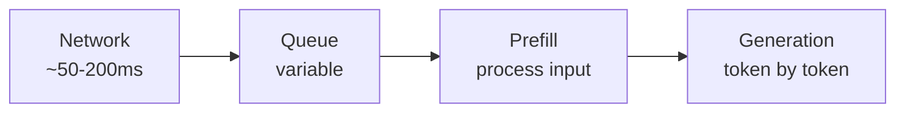
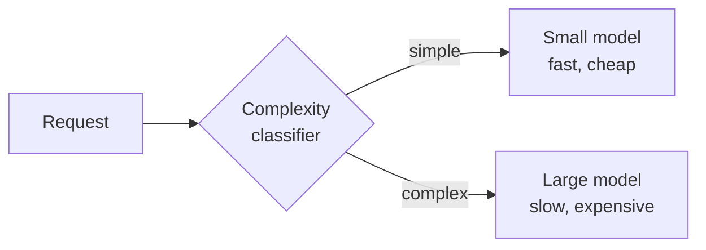

# Inference Economics

Every LLM request has three costs: input tokens, output tokens, and time. Whether your AI system is financially viable — and what features you can afford to build — depends on how you manage these three dimensions.

## How pricing works

Most hosted LLM providers charge per token, with different rates for input and output:

- **Input tokens** (your prompt + context): cheaper, typically $0.25–$5 per million tokens for frontier models

- **Output tokens** (what the model generates): more expensive, typically $1–$15 per million tokens

Output tokens cost 3-5x more than input tokens because generation is sequential — each token must be produced one at a time, which can't be parallelized. Input tokens, by contrast, are all processed in a single parallel batch. The hardware utilization is much worse for sequential generation, hence the price difference.

For a typical production call:

- 2,000 input tokens (system prompt + context + user message)

- 500 output tokens (the response)

- At $3/M input and $15/M output: that's $0.006 + $0.0075 = ~$0.014 per request

Sounds cheap. At 100K requests/day, that's $1,400/day or ~$42K/month. And that's before agent loops multiply things.

## Where the money actually goes

**Output tokens dominate cost for generative workloads.** If your system generates long responses, that's where most of the bill comes from. Shortening outputs (through prompt constraints or post-processing) is often the highest-leverage cost optimization.

**Agent loops multiply everything.** A 10-step agent makes 10 LLM calls minimum. Each call has its own input and output tokens. A single user request that triggers a 10-step agent with 2K input and 500 output tokens per step costs 10x what a single call would. Budget accordingly.

**Context length compounds.** As an agent loop runs, the context grows (previous steps get appended). Step 1 might have 2K input tokens. Step 5 might have 8K. Step 10 might have 15K. The cost per step increases as the loop runs.

## Prompt caching: the biggest single optimization

Most providers now offer prompt caching — they store the computation for the beginning of your prompt so it doesn't get reprocessed on every request.

How it works: if the first N tokens of your prompt are identical across requests (your system prompt + task spec), the provider caches that computation. Subsequent requests only pay full price for the tokens that differ (the per-request context and user input).

Savings can be 50-90% on the cached portion of input token costs for systems with long, stable system prompts. The bigger your stable prefix relative to the variable suffix, the bigger the saving.

Requirements:

- The cached prefix must be identical across requests (byte-for-byte)

- Put stable content first, variable content last

- Minimum prefix length varies by provider (usually 1K-2K tokens)

This is why the advice in the prompting chapter to "put stable content first, variable content last" matters for cost, not just quality.

## Latency: where the time goes

- **Network latency** — round trip to the provider. 50-200ms typically.

- **Queue time** — waiting for capacity. Usually small, can spike during high demand.

- **Prefill** — processing all input tokens. Roughly proportional to input length. Fast for short prompts, noticeable for 100K+ token contexts.

- **Generation** — producing output tokens one at a time. This is the slow part. Proportional to output length.

**Time to first token (TTFT)** = network + queue + prefill. This is what the user waits before seeing anything.

**Time to last token** = TTFT + (output tokens × time per token). This is total response time.

**Streaming** sends tokens to the user as they're generated. It doesn't make total time faster, but it makes perceived latency much better — the user sees output starting within 1-2 seconds instead of waiting 5-10 seconds for the full response.

For interactive applications, TTFT under 1 second is the target. For batch processing, total throughput matters more than per-request latency.

## Model routing: small model for easy cases, big model for hard ones

Not every request needs a frontier model. A simple classification might work fine with a small, fast, cheap model. A complex reasoning task needs the big one.

**Model routing** sends each request to the appropriate model based on complexity:

The classifier can be:

- A small LLM that estimates difficulty

- A rule-based system (short queries → small model, long queries → large model)

- A trained classifier based on historical data

This can cut costs 50-70% if most of your traffic is simple requests. The trade-off: you need to handle cases where the small model fails and needs to be escalated to the large one.

## Capacity and rate limits

Providers impose limits:

- **TPM (Tokens Per Minute)** — how many tokens you can process per minute

- **RPM (Requests Per Minute)** — how many API calls per minute

At scale, you'll hit these. Strategies:

- **Queuing** — buffer requests and process them within your rate limit

- **Multi-provider** — spread load across providers (but behavior differs between models)

- **Batching** — some providers offer batch APIs that are cheaper but slower (hours, not seconds)

- **Caching responses** — if the same question comes up repeatedly, cache the answer

## Cost estimation before building

Before building an AI feature, estimate the cost:

1. Estimate average input tokens per request (system prompt + typical context + user input)

2. Estimate average output tokens per request

3. Multiply by expected request volume

4. Multiply by agent loop depth if applicable

5. Apply prompt caching discount to the stable prefix portion

6. Add 2-3x buffer for edge cases and growth

If the number is too high, your options are:

- Shorter prompts or context

- Shorter outputs (constrain response length)

- Smaller models for some or all traffic

- Caching repeated queries

- Reducing agent loop depth

- Deciding the feature isn't worth building with AI

That last option is valid. Some features are too expensive for AI at current prices. Prices drop over time, so "not now" doesn't mean "never."

## Things that trip people up

**Underestimating agent costs.** A demo that costs $0.01 per request becomes $0.50 per request when the agent loops 10 times on a complex query. Monitor per-request cost in production, not just average.

**Ignoring tail latency.** P50 latency might be 2 seconds. P99 might be 15 seconds. For interactive applications, the worst-case experience matters more than the average.

**Provider capacity isn't infinite.** At scale, you'll hit rate limits. Plan for queuing, fallback, or multi-provider strategies before you need them.

**Token counts vary by tokenizer.** A "1000-word document" might be 1200 tokens on one model and 1500 on another. Budget with the actual tokenizer for your model.

**Forgetting about the context growth in agent loops.** Each step appends to the context. By step 10, you might be sending 5x the tokens you sent on step 1.

## Where things stand

Inference costs have been dropping roughly 10x every 18 months from 2023-2025 (through better hardware, better models, and competition). Whether that rate continues is unclear — it may slow as the easy optimizations are exhausted. Features that are too expensive today may be viable in a year. But "it'll be cheaper later" isn't a shipping strategy — you need to make the economics work now or wait.

The most impactful optimizations in order: prompt caching, model routing, output length constraints, agent loop budgets. Do these before anything exotic.

## Go deeper

- [Provider pricing pages](https://docs.anthropic.com/en/docs/about-claude/models) (Anthropic, OpenAI, Google) — check current rates

- [LiteLLM](https://github.com/BerriAI/litellm) — multi-provider routing and cost tracking

- [OpenRouter](https://openrouter.ai/) — model routing across providers
