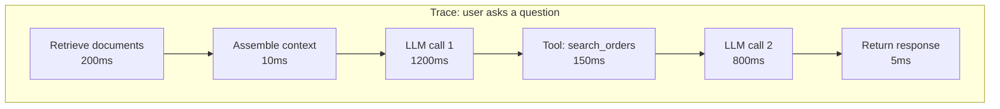

# Observability for AI Systems

In traditional systems, observability is logs, metrics, and traces. In AI systems, you need all three plus the ability to reconstruct exactly what the model saw and produced on any past call. Without that, debugging is guesswork.

The question you need to be able to answer at any time: "What did the model see when it produced that output?"

## What to instrument

Every LLM call should log:

- **The full prompt** — system prompt + assembled context + user input. Not the template — the actual text the model received.

- **The full response** — raw output, including any reasoning or tool calls.

- **Metadata** — model name and version, temperature, token counts (input and output), finish reason (completed, max tokens, stop sequence), latency.

- **Tool calls** — if the model called tools: which tool, what arguments, what the tool returned, how long it took, whether it errored.

- **Agent loop state** — for agents: which step, what the context looked like at each step, what decision was made.

This sounds like a lot of data. It is. You'll need to balance completeness with cost and privacy (more on that below).

## Tracing AI applications

A trace follows a single user request through your system. For a simple LLM call, the trace has one span. For an agent, it might have 10+ spans — one per LLM call, one per tool call, one per decision point.

OpenTelemetry (the standard observability framework) has semantic conventions for LLM calls — standard attribute names for model, tokens, latency, etc. Using these means your traces are compatible with multiple observability backends.

## Metrics that matter

**Latency:**

- Time to first token (TTFT) — what the user waits before seeing anything

- Total response time — end to end

- Track p50, p95, p99 — tail latency is what kills user experience

**Quality:**

- Eval scores on a sampled subset of production calls (run your eval harness continuously)

- User feedback rates (thumbs up/down, corrections, escalations)

- Refusal rate — how often the model declines to answer

- Parse failure rate — how often the output doesn't match expected format

**Cost:**

- Tokens in and out per request

- Dollar cost per request

- Cost per user, per feature, per team

**Errors:**

- API errors (timeouts, rate limits, 500s from the provider)

- Tool call failures

- Agent loop timeouts (hit max steps)

## Online evaluation (eval in production)

Your offline eval harness tests against a fixed set of cases. Online evaluation tests against real traffic.

Approaches:

- **Sample and score.** Pick 1-5% of production calls. Run your LLM-as-judge scorer on them. Track the score over time. If it drops, something changed.

- **Human review queue.** Route a small sample to human reviewers. More expensive but catches things automated scoring misses.

- **User signals.** Track thumbs up/down, "was this helpful?" responses, follow-up questions (which often indicate the first answer wasn't good enough), escalations to humans.

The goal: detect quality regressions in production before users complain. A dashboard showing "quality score over time" with an alert threshold is the minimum.

## Drift detection

Quality can degrade without anyone changing anything:

- The model provider pushes an update

- User behavior shifts (new topics, new patterns)

- Retrieved documents change (knowledge base updated)

- External APIs change their responses

Drift detection compares current quality metrics against a baseline. When the difference exceeds a threshold, alert. This is the AI equivalent of anomaly detection on your traditional metrics.

## The tools

**Specialized AI observability:**

- **Langfuse** — open-source, widely used, good tracing + eval integration

- **Braintrust** — hosted, strong eval focus, good for managing test sets

- **Helicone** — focused on cost tracking and request logging

- **LangSmith** — LangChain's companion tool, tightly integrated with that ecosystem

- **Arize Phoenix** — open-source, strong on traces and evals together

**General observability (works too):**

- OpenTelemetry + your existing stack (Datadog, Grafana, etc.)

- Structured logs to your existing log aggregator

- Custom dashboards in whatever you already use

You don't need a specialized tool to start. Structured logging of every LLM call (prompt, response, metadata) into your existing log system gets you 80% of the value. Specialized tools add better UX for browsing traces, running evals, and comparing prompt versions.

## Privacy and cost of logging

Logging full prompts means logging user data. This creates obligations:

- **PII in logs.** User messages, retrieved documents, and tool outputs often contain personal information. Redact or mask sensitive fields before logging.

- **Encryption at rest.** Logs containing user data should be encrypted.

- **Retention policies.** Don't keep logs forever. Set a retention period (30 days, 90 days) and auto-delete.

- **Access controls.** Not everyone should be able to read full prompt logs.

- **Cost.** Full-context logging at scale is expensive (storage + processing). Sample intelligently — log 100% of errors and a random 5-10% of successful calls.

## Things that trip people up

**Logging the prompt template, not the actual prompt.** Your template says `{system_prompt} + {context} + {user_input}`. Your logs show the template variables. When debugging, you need the fully assembled text the model actually received. Log that.

**No correlation IDs.** A multi-step agent makes 5 LLM calls. Without a shared request ID linking them, you can't reconstruct the full trajectory. Use correlation IDs from the start.

**Dashboards without alerts.** A dashboard you check once a week is decorative. Set alert thresholds on key metrics (latency p99, error rate, quality score) so you know when things break.

**Prompt caching makes latency metrics misleading.** A cached request is fast; an uncached one is slow. If you don't account for cache state in your metrics, your latency numbers are noisy and hard to interpret.

**"The model did X" is not reproducible without full context.** If someone reports a bad output and you can't find the exact prompt that produced it, you can't debug it. Full-context logging is the only way to make AI behavior reproducible.

## Where things stand

AI observability tooling is maturing fast. The patterns are clear (trace every call, log full context, run continuous eval, alert on drift). The tools are getting better. The main gap is that most teams under-invest in observability early and then struggle to debug production issues.

Start simple: log every LLM call with full context, model, and metadata. Add tracing when you have agents. Add continuous eval when you have enough traffic to sample. Add drift detection when you've been running long enough to have a baseline.

## Go deeper

- [Workshop W6 — Observability Setup](../05-workshops/W6-observability-setup.md). Instrument an agent end-to-end.

- [Langfuse documentation](https://langfuse.com/docs) — open-source, good starting point

- [OpenTelemetry semantic conventions for LLMs](https://opentelemetry.io/docs/specs/semconv/gen-ai/) — the emerging standard

- [Braintrust blog](https://www.braintrust.dev/blog) — production observability patterns
