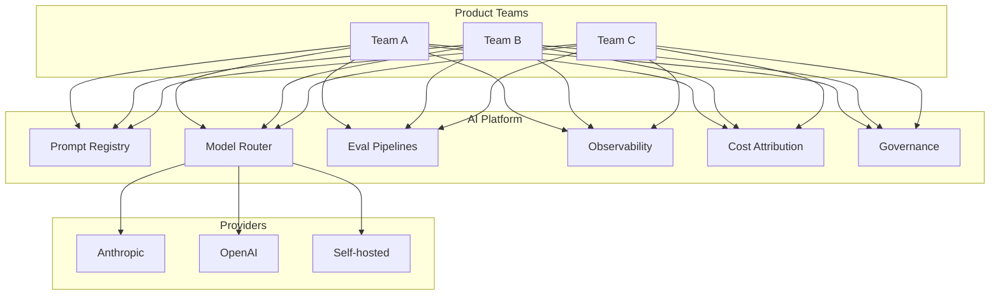

# AI Platform Engineering

If your organization has more than a handful of AI features, you need a platform. Otherwise every team reinvents prompt versioning, eval harnesses, observability, rate limiting, and cost tracking. This is where DevOps was in 2015 — the patterns are emerging, the tooling is splintered, and there's a huge gap between teams that have invested and teams that haven't.

## What an AI platform provides

Think of it as the shared infrastructure that sits between your product teams and the model providers:

### The components

**Prompt registry.** Versioned storage for prompts with metadata (which model, which feature, who owns it, when it last changed). Lets you track what's in production, roll back changes, and compare versions.

**Model routing.** A layer that decides which model handles each request. Can route based on cost, latency, complexity, or feature flags. Also handles fallback when a provider is down.

**Eval pipelines.** Shared infrastructure for running evaluations — both offline (on test sets) and online (on production samples). Ideally triggered automatically on prompt or model changes.

**Observability.** Centralized tracing, logging, and metrics for all AI calls across all teams. Covered in chapter 12.

**Cost attribution.** Tracking which team, feature, and user is responsible for which costs. Without this, you get surprise bills and no accountability.

**Governance.** Who can use which models, with which data, for which purposes. Approval workflows for new AI features. Safety review gates.

**Rate limiting and quotas.** Per-team, per-feature limits to prevent one team's runaway agent from consuming all available capacity.

**Secret management.** API keys for model providers, stored securely, rotated regularly, scoped to specific teams or features.

## Developer experience

The platform should make it easy for product engineers to build AI features without becoming AI infrastructure experts:

- **Prompt playground.** A UI where engineers can test prompts against different models, see token counts, and compare outputs.
- **SDKs / wrappers.** A thin layer around provider APIs that automatically adds observability, retries, fallbacks, and cost tracking. Engineers import your SDK instead of calling the provider directly.
- **Templates.** Starter patterns for common use cases (chat, RAG, classification, extraction). Not frameworks — just well-documented starting points.
- **Local dev with production parity.** Engineers should be able to test against the same models and prompts locally that run in production.

## Buy vs build

| Component | Buy (use a vendor) | Build (do it yourself) |
|---|---|---|
| Prompt registry | Braintrust, Langfuse | Simple: git repo + metadata file |
| Model routing | LiteLLM, OpenRouter | Custom: a few hundred lines of code |
| Eval pipelines | Braintrust, Promptfoo | Custom: specific to your tasks |
| Observability | Langfuse, Helicone, LangSmith | OpenTelemetry + your existing stack |
| Cost tracking | Helicone, LiteLLM | Custom: parse provider invoices |
| Governance | Custom (usually) | Custom (always) |

Most teams end up with a mix: buy the observability and cost tracking (commodity problems), build the eval pipelines and governance (specific to your organization).

The integration layer — the thing that ties all these pieces together and presents a coherent developer experience — is almost always custom. No vendor sells "your AI platform." They sell components of it.

## When to invest

**Too early:** you have one AI feature, one team, one model. A platform is overhead. Just build the feature.

**Right time:** you have 3+ teams building AI features, or you're about to. Patterns are repeating (everyone is solving prompt versioning independently). Cost is becoming hard to track. Quality is inconsistent across features.

**Too late:** every team has their own prompt storage, their own eval approach, their own provider integration. Consolidating is now a migration project, not a greenfield build.

The sweet spot is usually when the second or third team starts building AI features. That's when the patterns become clear enough to abstract.

## Things that trip people up

**Building the platform before you know what you need.** Platforms that solve problems nobody has are shelfware. Build the first 2-3 AI features without a platform. Notice what's painful. Then build the platform to solve those specific pains.

**No platform at all.** Every team reinvents everything. Inconsistent quality, duplicated effort, no shared learning. This doesn't scale past 3-4 teams.

**Ignoring cost attribution.** Without it, nobody owns the bill. One team's experiment costs $50K/month and nobody notices until the invoice arrives.

**Over-engineering the prompt registry.** A git repo with markdown files and a CHANGELOG is a perfectly good prompt registry for most teams. You don't need a database with a UI and approval workflows until you have 50+ prompts across 10+ teams.

**Platform team that doesn't ship AI features themselves.** Platform teams that only build infrastructure without using it tend to build the wrong things. The best AI platform teams also own at least one production AI feature.

## Where things stand

AI platform engineering is early. The patterns are clear (the components listed above) but the tooling is fragmented and immature. Most organizations are building custom platforms from a mix of vendor tools and internal code.

In 2-3 years, this will likely consolidate the way DevOps tooling did — a few dominant platforms, clear best practices, less custom work. Today, you're building on shifting ground. Keep your platform thin, focused on real pain points, and easy to evolve.

## Go deeper

- [LiteLLM](https://github.com/BerriAI/litellm) — multi-provider proxy with cost tracking
- [Langfuse](https://langfuse.com) — open-source observability + eval
- [Braintrust](https://www.braintrust.dev) — eval-focused platform
- [Humanloop](https://humanloop.com) — prompt management and eval
