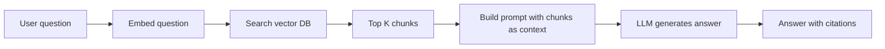

# Workshop W2 — First RAG Pipeline

**Goal:** Build a retrieval-augmented generation pipeline end-to-end. Understand each component well enough to have opinions about it.

**Time:** 3-4 hours

**Prerequisites:** Python, a working LLM (local via Ollama from W1, or an API key for Claude/OpenAI)

---

## What you're building

A system that:
1. Takes a collection of documents
2. Splits them into chunks
3. Converts chunks into vectors (embeddings)
4. Stores them in a vector database
5. When a user asks a question, finds the most relevant chunks
6. Feeds those chunks to an LLM as context
7. Generates an answer grounded in the retrieved documents



---

## Part 1: Pick a corpus (15 min)

You need documents to search over. Options:

- **Your own docs** — meeting notes, internal wiki pages, project documentation. Most realistic.
- **A public dataset** — Wikipedia articles on a topic, a set of blog posts, documentation for a library you use.
- **A small set of PDFs** — research papers, reports, manuals.

Start with 10-50 documents. Enough to be interesting, small enough to iterate fast.

For this workshop, I'll assume you're using a folder of markdown or text files. Adjust if you're using PDFs (you'll need a PDF parser like `pymupdf` or `unstructured`).

---

## Part 2: Chunking (30 min)

Split your documents into smaller pieces. The model can't use a 50-page document as context — it needs focused chunks.

```python
def chunk_text(text, chunk_size=500, overlap=50):
    """Split text into overlapping chunks of roughly chunk_size tokens."""
    words = text.split()
    chunks = []
    start = 0
    while start < len(words):
        end = start + chunk_size
        chunk = ' '.join(words[start:end])
        chunks.append(chunk)
        start = end - overlap  # overlap with previous chunk
    return chunks
```

**Try two strategies and compare:**

1. **Fixed-size chunks** (above) — simple, predictable size, but may split mid-sentence
2. **Sentence-boundary chunks** — split at sentence boundaries, varying size but more coherent

```python
import re

def chunk_by_sentences(text, max_chunk_size=500):
    """Split at sentence boundaries, keeping chunks under max size."""
    sentences = re.split(r'(?<=[.!?])\s+', text)
    chunks = []
    current_chunk = []
    current_size = 0
    
    for sentence in sentences:
        words = len(sentence.split())
        if current_size + words > max_chunk_size and current_chunk:
            chunks.append(' '.join(current_chunk))
            current_chunk = []
            current_size = 0
        current_chunk.append(sentence)
        current_size += words
    
    if current_chunk:
        chunks.append(' '.join(current_chunk))
    return chunks
```

Process all your documents. Note how many chunks you get and their average size.

---

## Part 3: Embedding (30 min)

Convert each chunk into a vector — a list of numbers that represents its meaning. Similar chunks will have similar vectors.

**Option A: Local embeddings (free, private)**

```python
from sentence_transformers import SentenceTransformer

model = SentenceTransformer('all-MiniLM-L6-v2')  # small, fast, decent quality
embeddings = model.encode(chunks)
print(f"Each chunk becomes a vector of {embeddings[0].shape[0]} dimensions")
```

Install: `pip install sentence-transformers`

**Option B: Hosted embeddings (better quality, costs money)**

```python
import openai

client = openai.OpenAI()  # or use Anthropic's Voyage AI

response = client.embeddings.create(
    model="text-embedding-3-small",
    input=chunks
)
embeddings = [item.embedding for item in response.data]
```

For this workshop, local embeddings are fine. The quality difference matters less than you'd think for a first pass.

---

## Part 4: Vector store (30 min)

Store the embeddings so you can search them. Use Chroma (simple, local, no server needed):

```python
import chromadb

client = chromadb.Client()
collection = client.create_collection("my_docs")

# Add all chunks with their embeddings
collection.add(
    documents=chunks,
    ids=[f"chunk_{i}" for i in range(len(chunks))],
    metadatas=[{"source": "doc_name", "chunk_index": i} for i in range(len(chunks))]
)
```

Install: `pip install chromadb`

Now search:

```python
results = collection.query(
    query_texts=["What is the refund policy?"],
    n_results=5
)
print(results['documents'][0])  # top 5 most relevant chunks
```

Try a few queries. Are the results relevant? This is your first taste of retrieval quality — and where most RAG problems live.

---

## Part 5: Generation (30 min)

Now combine retrieval with generation:

```python
def ask(question, n_results=5):
    # Retrieve relevant chunks
    results = collection.query(query_texts=[question], n_results=n_results)
    context_chunks = results['documents'][0]
    
    # Build the prompt
    context = "\n\n---\n\n".join(context_chunks)
    prompt = f"""Answer the question based on the context below. 
If the context doesn't contain the answer, say "I don't have information about that."
Cite which section you're drawing from.

Context:
{context}

Question: {question}

Answer:"""
    
    # Call the model (adjust for your setup)
    response = client.chat.completions.create(
        model="llama3.2:3b",  # or "claude-sonnet-4-20250514" etc.
        messages=[{"role": "user", "content": prompt}]
    )
    return response.choices[0].message.content

print(ask("What is the refund policy?"))
```

Try 10 questions. Note:
- Does it answer correctly when the information is in the documents?
- Does it say "I don't know" when the information isn't there?
- Does it cite sources?
- Does it hallucinate (make up information not in the context)?

---

## Part 6: Add re-ranking (30 min)

Re-ranking is a second pass that re-scores the retrieved chunks with a more precise model. Often the single biggest quality improvement.

```python
from sentence_transformers import CrossEncoder

reranker = CrossEncoder('cross-encoder/ms-marco-MiniLM-L-6-v2')

def ask_with_rerank(question, n_retrieve=20, n_use=5):
    # Retrieve more candidates than we'll use
    results = collection.query(query_texts=[question], n_results=n_retrieve)
    candidates = results['documents'][0]
    
    # Re-rank with cross-encoder
    pairs = [[question, doc] for doc in candidates]
    scores = reranker.predict(pairs)
    
    # Take top N after re-ranking
    ranked = sorted(zip(scores, candidates), reverse=True)
    top_chunks = [doc for _, doc in ranked[:n_use]]
    
    # Generate (same as before)
    context = "\n\n---\n\n".join(top_chunks)
    # ... same prompt and generation as Part 5
```

Compare answers with and without re-ranking on the same questions. You should see improvement, especially on ambiguous queries where the initial retrieval returns a mix of relevant and irrelevant chunks.

---

## Part 7: Measure quality (30 min)

Build a simple eval. Write 10 questions where you know the correct answer (or at least which document should be cited):

```python
test_cases = [
    {"question": "What is the refund policy?", "expected_source": "returns.md", "expected_contains": "30 days"},
    {"question": "How do I reset my password?", "expected_source": "account.md", "expected_contains": "settings"},
    # ... 8 more
]

for case in test_cases:
    answer = ask(case["question"])
    contains_expected = case["expected_contains"].lower() in answer.lower()
    print(f"Q: {case['question']}")
    print(f"  Contains expected info: {contains_expected}")
    print(f"  Answer: {answer[:200]}...")
    print()
```

This is a minimal eval. In production you'd use LLM-as-judge, check citation accuracy, and measure on hundreds of cases. But even 10 cases with manual review teaches you a lot about where your pipeline fails.

---

## Part 8: Reflect

After building this, you should be able to answer:

1. How does chunk size affect retrieval quality?
2. What happens when the answer spans multiple chunks?
3. How much does re-ranking actually help on your data?
4. When does the system hallucinate vs. correctly say "I don't know"?
5. What would you change for a production deployment?

---

## Gotchas you'll encounter

- **Chunk boundaries split relevant information.** The answer is half in one chunk and half in another. Overlapping chunks help but don't fully solve this.
- **Embedding model matters.** Different embedding models have different strengths. If your documents are code-heavy, a general-purpose embedding model may underperform.
- **"I don't know" is hard to get right.** Models tend to answer even when they shouldn't. You'll need to iterate on the prompt to get reliable refusals.
- **Metadata is important.** Knowing which document a chunk came from (for citations) requires storing metadata alongside embeddings.

## Go deeper

- [Anthropic's "Contextual Retrieval" blog post](https://www.anthropic.com/news/contextual-retrieval) — technique that improves chunk quality
- [Chroma documentation](https://docs.trychroma.com/) — the vector DB used here
- [MTEB leaderboard](https://huggingface.co/spaces/mteb/leaderboard) — compare embedding models
- Chapter 03 (Context Engineering) covers the theory behind what you just built
