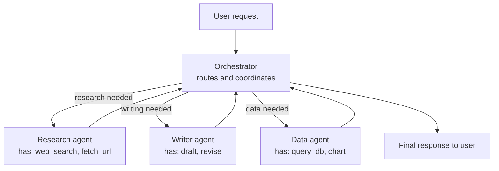

# Workshop W5 — Multi-Agent System

**Goal:** Build an orchestrator + specialists pattern and experience the failure modes firsthand.

**Time:** 3-4 hours

**Prerequisites:** Completed W4 (tool-using agent). Python, LLM API access.

---

## What you're building

A system with multiple agents coordinating on a task:

- An **orchestrator** that receives the user's request and decides which specialist to call

- 2-3 **specialist agents**, each with their own tools and focused prompts

- A coordination mechanism (shared state or message passing)



---

## Part 1: Define the specialists (30 min)

Pick a scenario. A good one for this workshop: "Research assistant that can search, summarize, and produce a report."

**Research specialist:**

```python
research_agent = {
    "system_prompt": "You are a research specialist. Your job is to find relevant information on a topic. Use your tools to search and fetch content. Return a structured summary of what you found.",
    "tools": [web_search_tool, fetch_url_tool],
    "max_steps": 5
}

```

**Writer specialist:**

```python
writer_agent = {
    "system_prompt": "You are a writing specialist. Given research notes, produce a clear, well-structured summary or report. You do not search for information — you work with what you're given.",
    "tools": [],  # no tools — just generation
    "max_steps": 1
}

```

**Orchestrator:**

```python
orchestrator = {
    "system_prompt": """You coordinate a team of specialists to answer user requests.

Available specialists:

- research: Can search the web and fetch content. Use when you need information.

- writer: Can produce polished text from notes. Use when you have information and need it formatted.

Your job: break the user's request into steps, delegate to specialists, and combine their outputs into a final answer.

Respond with JSON indicating your next action:
{"action": "delegate", "specialist": "research", "instruction": "..."}
or
{"action": "delegate", "specialist": "writer", "instruction": "...", "context": "..."}
or
{"action": "respond", "final_answer": "..."}""",
    "tools": [],
    "max_steps": 8
}

```

---

## Part 2: Build the coordination loop (45 min)

```python
def run_multi_agent(user_request, max_rounds=5):
    orchestrator_messages = [
        {"role": "system", "content": orchestrator["system_prompt"]},
        {"role": "user", "content": user_request}
    ]

    trace = {"rounds": []}

    for round_num in range(max_rounds):
        # Ask orchestrator what to do next
        response = call_llm(orchestrator_messages)
        decision = json.loads(response)

        trace["rounds"].append({"orchestrator_decision": decision})

        if decision["action"] == "respond":
            return decision["final_answer"], trace

        elif decision["action"] == "delegate":
            specialist = decision["specialist"]
            instruction = decision["instruction"]
            context = decision.get("context", "")

            # Run the specialist
            specialist_result = run_specialist(
                specialist, instruction, context
            )

            trace["rounds"][-1]["specialist_result"] = specialist_result

            # Feed result back to orchestrator
            orchestrator_messages.append(
                {"role": "assistant", "content": json.dumps(decision)}
            )
            orchestrator_messages.append(
                {"role": "user", "content": f"Result from {specialist}: {specialist_result}"}
            )

    return "Could not complete within round limit.", trace


def run_specialist(specialist_name, instruction, context):
    """Run a specialist agent and return its output."""
    if specialist_name == "research":
        return run_agent(  # reuse your W4 agent loop
            f"{instruction}\n\nContext: {context}",
            tools=research_agent["tools"],
            system_prompt=research_agent["system_prompt"],
            max_steps=research_agent["max_steps"]
        )
    elif specialist_name == "writer":
        return call_llm_simple(
            system=writer_agent["system_prompt"],
            user=f"{instruction}\n\nSource material:\n{context}"
        )

```

---

## Part 3: Run it and observe (30 min)

Try these requests:

1. "Research the current state of AI agents and write a 3-paragraph summary"

2. "Find information about MCP (Model Context Protocol) and explain it simply"

3. "Compare LangChain and LangGraph — what are the trade-offs?"

For each, look at the trace:

- How many rounds did the orchestrator take?

- Did it delegate to the right specialist?

- Did the specialist produce useful output?

- Did the orchestrator combine things well?

---

## Part 4: Break it deliberately (30 min)

Now trigger the failure modes:

**Orchestrator loops:** Give a vague request like "Help me". Watch if the orchestrator keeps delegating without converging.

**Specialist fails:** Make the research tool return an error. Does the orchestrator handle it gracefully or get stuck?

**Orchestrator delegates to wrong specialist:** Ask a writing question and see if it unnecessarily calls research first.

**Cost explosion:** Count the total LLM calls across all agents for a single user request. Compare to what a single agent would have cost.

**Context loss between agents:** The orchestrator summarizes the research result before passing to the writer. Does important detail get lost?

---

## Part 5: Add guardrails (30 min)

Based on what broke, add:

**Budget tracking:**

```python
total_llm_calls = 0
max_total_calls = 20

def call_llm_with_budget(messages, **kwargs):
    global total_llm_calls
    total_llm_calls += 1
    if total_llm_calls > max_total_calls:
        raise BudgetExceeded(f"Hit {max_total_calls} LLM calls limit")
    return call_llm(messages, **kwargs)

```

**Loop detection:**

```python
# If orchestrator makes the same delegation twice in a row, force it to respond
if len(trace["rounds"]) >= 2:
    last_two = trace["rounds"][-2:]
    if (last_two[0]["orchestrator_decision"] == last_two[1]["orchestrator_decision"]):
        # Force a final response
        orchestrator_messages.append(
            {"role": "user", "content": "You've already tried this. Please provide your best answer with what you have."}
        )

```

**Timeout per specialist:**

```python
import signal

def run_specialist_with_timeout(specialist_name, instruction, context, timeout=30):
    # ... add a timeout so a stuck specialist doesn't block forever

```

---

## Part 6: Compare cost and quality (30 min)

Run the same 3 requests through:

1. Your multi-agent system

2. A single agent with all tools available (from W4, but with research + writing tools combined)

Compare:

- **Quality:** Is the multi-agent output actually better?

- **Cost:** How many LLM calls total? How many tokens?

- **Latency:** How long does each approach take?

- **Debuggability:** Which is easier to understand when something goes wrong?

Write down your findings. In many cases, the single agent is simpler, cheaper, and produces comparable quality. That's a valid conclusion — it means multi-agent wasn't needed for this task.

---

## Gotchas

- **Multi-agent multiplies cost.** Every delegation is at least 2 LLM calls (orchestrator decides + specialist executes). A 3-round multi-agent flow is 6+ calls minimum.

- **Context gets lost between agents.** The orchestrator summarizes before passing to the next specialist. Important details can be dropped. Consider passing raw outputs when feasible.

- **Debugging is hard.** When the final output is wrong, you need to trace back through multiple agents to find where things went wrong. Good logging from the start is essential.

- **The orchestrator is a single point of failure.** If it misroutes, everything downstream is wrong.

- **"Let them discuss" doesn't converge.** If you try having two agents debate, they'll loop. LLMs don't have genuine disagreements — they have different sampling paths.

---

## What you should have after this workshop

- A working multi-agent system with orchestrator + specialists

- Experience with the coordination overhead and failure modes

- Cost comparison between multi-agent and single-agent approaches

- An informed opinion about when multi-agent is worth the complexity

- Guardrails (budget, loop detection, timeouts) that prevent runaway behavior

## Go deeper

- [AutoGen documentation](https://microsoft.github.io/autogen/) — framework designed for multi-agent

- [LangGraph multi-agent patterns](https://langchain-ai.github.io/langgraph/tutorials/multi_agent/) — graph-based coordination

- [Chapter 10 (Multi-Agent Patterns)](../02-agents/10-multi-agent-patterns.md) covers the theory and anti-patterns
